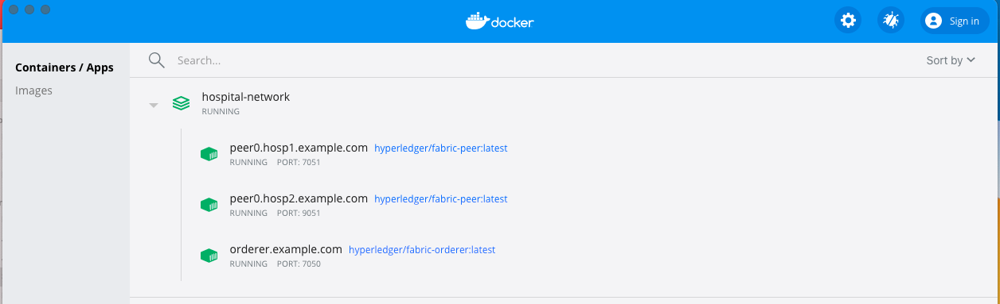
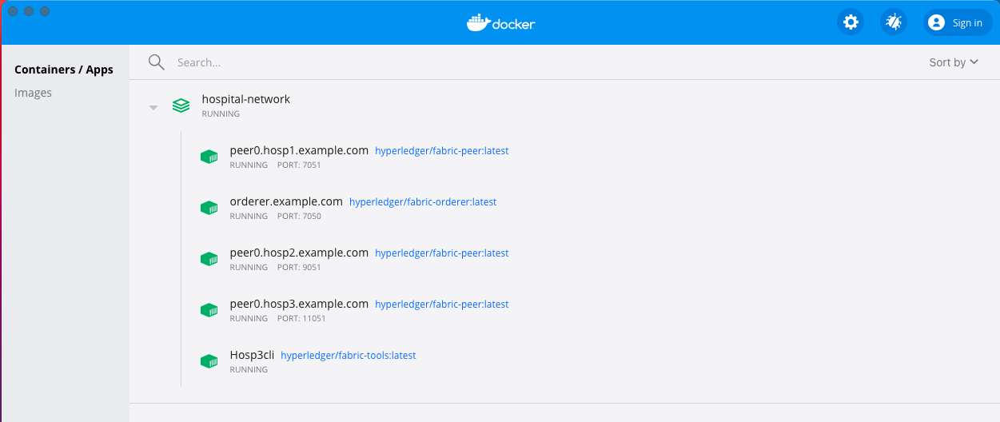
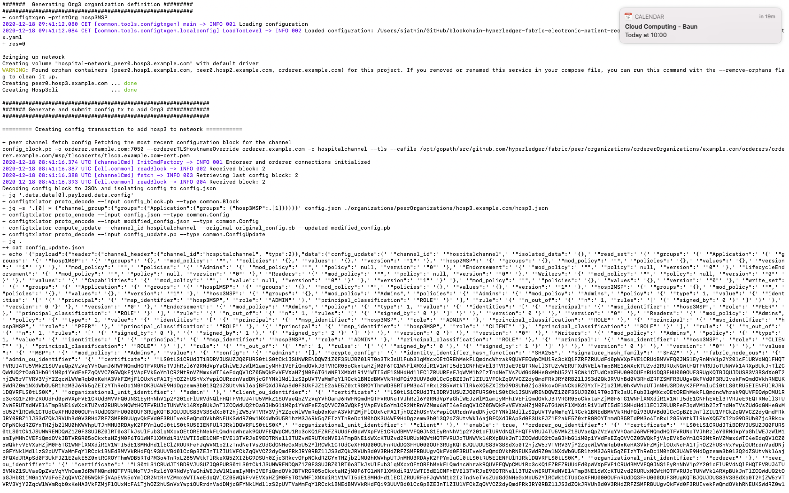

## Running the first hospital network

Before you can deploy the hospital network, you need to follow the instructions to [Install the Samples, Binaries and Docker Images](https://hyperledger-fabric.readthedocs.io/en/latest/install.html) in the Hyperledger Fabric documentation.

1. Execute ```./network.sh up```.
    - The above command will create two Organization Hosp 1 and Hosp 2. With one orderer and consortium created. Certificates are generated by cryptogen.

        

2. Execute ```./network.sh createChannel -c hospitalchannel```
    - A channel is created. Default name of channel is hospitalchannel.

    

3. Execute ```cd addHosp3```.
4. Execute ```./addHosp3.sh up``` 
    - The command creates Hosp 3 and adds the organization to the hospitalchannel channnel.

    

    
5. To deploy the patient chaincode on hospitalchannel, 
    - First up the network with couchdb using command - ```./network.sh up createChannel -c hospitalchannel -s couchdb```
    - Deploy chaincode patient ```./network.sh deployCC -c hospitalchannel -ccn patient -ccv 1 -cci initLedger```
    - Then Execute following commands - 
    	export PATH=${PWD}/../bin:$PATH
	export FABRIC_CFG_PATH=$PWD/../config/
	export CORE_PEER_TLS_ENABLED=true
	export CORE_PEER_LOCALMSPID="hosp1MSP"
	export CORE_PEER_TLS_ROOTCERT_FILE=${PWD}/organizations/peerOrganizations/hosp1.lithium.com/peers/peer0.hosp1.lithium.com/tls/ca.crt
	export CORE_PEER_MSPCONFIGPATH=${PWD}/organizations/peerOrganizations/hosp1.lithium.com/users/Admin@hosp1.lithium.com/msp
	export CORE_PEER_ADDRESS=localhost:7051
    - If initLedger argument is added in deployCC command, then ignore the following command. If not, execute this statement
      peer chaincode invoke -o localhost:7050 --ordererTLSHostnameOverride orderer.lithium.com --tls --cafile ${PWD}/organizations/ordererOrganizations/lithium.com/orderers/orderer.lithium.com/msp/tlscacerts/tlsca.lithium.com-cert.pem -C hospitalchannel -n patient --peerAddresses localhost:7051 --tlsRootCertFiles ${PWD}/organizations/peerOrganizations/hosp1.lithium.com/peers/peer0.hosp1.lithium.com/tls/ca.crt --peerAddresses localhost:9051 --tlsRootCertFiles ${PWD}/organizations/peerOrganizations/hosp2.lithium.com/peers/peer0.hosp2.lithium.com/tls/ca.crt --peerAddresses localhost:11051 --tlsRootCertFiles ${PWD}/organizations/peerOrganizations/hosp3.lithium.com/peers/peer0.hosp3.lithium.com/tls/ca.crt -c '{"function":"initLedger","Args":[]}'

6. Sample query - peer chaincode query -C hospitalchannel -n patient -c '{"Args":["readPatient","PATIENT1"]}'
7. To bring the network down 
    - ```./addHosp3 down```

## Troubleshooting
If errors like orderer keeps shutting down or a message like 
```!!!!!!!!!!!!!!! Fetching config block from orderer has Failed !!!!!!!!!!!!!!!!```. A initial research as of now is the docker image has been damaged. 

So execute the following command 
```docker stop $(docker ps -a -q)  ; docker rm -f $(docker ps -aq) ; docker system prune -a ; docker volume prune ; docker ps -a ; docker images -a ; docker volume ls```
WARNING: THIS WILL DELETE ALL DOCKER IMAGES, CACHES AND CONTAINERS

Once yo have executed the above command, install just the Docker images again. And execute the network scripts.
