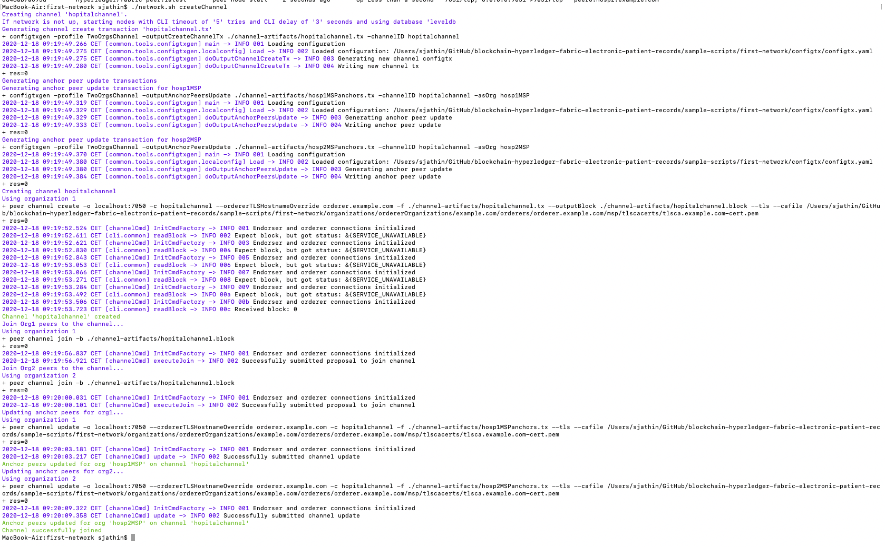

## Running the first test network

Before you can deploy the test network, you need to follow the instructions to [Install the Samples, Binaries and Docker Images](https://hyperledger-fabric.readthedocs.io/en/latest/install.html) in the Hyperledger Fabric documentation.

1. Execute ```./network.sh up```.
    - The above command will create two Organization Hosp 1 and Hosp 2. With one orderer and consortium created. Certificates are generated by cryptogen.

        

2. Execute ```./network.sh createChannel -c hospitalchannel```
    - A channel is created. Default name of channel is hospitalchannel.

    

3. Execute ```cd addHosp3```.
4. Execute ```./addHosp3 up``` 
    - The command creates Hosp 3 and adds the organization to the hospitalchannel channnel.

    

    

5. To bring the network down 
    - ```./addHosp3 down```

## Troubleshooting
If errors like orderer keeps shutting down or a message like 
```!!!!!!!!!!!!!!! Fetching config block from orderer has Failed !!!!!!!!!!!!!!!!```. A initial research as of now is the docker image has been damaged. 

So execute the following command 
```docker stop $(docker ps -a -q)  ; docker rm -f $(docker ps -aq) ; docker system prune -a ; docker volume prune ; docker ps -a ; docker images -a ; docker volume ls```
WARNING: THIS WILL DELETE ALL DOCKER IMAGES, CACHES AND CONTAINERS

Once yo have executed the above command, install just the Docker images again. And execute the network scripts.